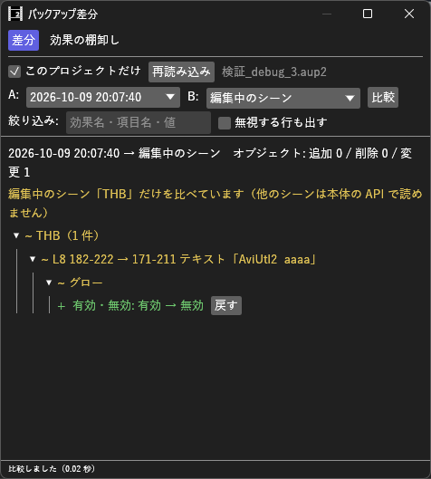

# BackupDiff_H マニュアル



**BackupDiff_H**（バックアップ差分）は、AviUtl2 の自動バックアップを 2 つ選び、その間にオブジェクト・効果・設定値の何が変わったかを一覧にするプラグイン（Rust 製 `.aux2`）です。
編集中のシーンと比べて前の値に戻す、ある項目の移り変わりを見る、どの効果をどれだけ使っているかを数える、もできます。
「さっきまでの値はいくつだったか」「いつからこの効果が無いか」を、バックアップを開き直さずに調べられます。

- **バージョン:** 0.4.0（2026-10-10: 絞り込みの欄で、入力中の Esc で入力する前の文字に戻るようにした。0.3.2 で中間点の数が違う値・別のシーンへは戻さない。0.3.1 で有効・無効の切り替えが `+` で出ていたのを `~` に直した。0.3.0 で効果の棚卸し、0.2.0 で値を戻す・項目の履歴）
- **作者:** by HexBrowns
- **必要環境:** AviUtl2 **2.1.11** 以上

**バックアップと保存したプロジェクトには書き込みません。** 編集中のタイムラインに書き込むのは、**戻す** を押したときだけです（本体の Undo 1 回分。Ctrl+Z で取り消せます）。

---

## 開き方

- **表示** メニュー → **バックアップ差分**

表示リストに出ない場合は AviUtl2 を再起動してください。

## 導入

1. [Releases](https://github.com/HexBrowns/BackupDiff_H/releases) から `HexBrowns.BackupDiff_H-v0.4.0.au2pkg.zip` をダウンロードし、AviUtl2 のプレビューへドラッグ&ドロップする
   （手で置くなら、中の `Plugin` フォルダをデータフォルダ `C:\ProgramData\aviutl2` へコピーする）
2. AviUtl2 を再起動する
3. **表示** メニュー → **バックアップ差分** でウィンドウを開く

導入されるのは `Plugin\BackupDiff_H\BackupDiff_H.aux2` だけです。

---

## 使い方

1. 比べたいプロジェクトを開いて、**表示** → **バックアップ差分** を開く
2. **A**（古い方）と **B**（新しい方）を選ぶ。開いたときは「最新」と「その 1 つ前」が選ばれています
3. **比較** を押す

結果は **シーン → オブジェクト → 効果 → 項目** の順に、折りたためる一覧で出ます。

```
~ Root（2 件）
  ~ L3 → L5 161-190 → 182-211 テキスト「THB-09 …」   ← 移動
  ~ L1 0-59 テキスト「一」
      ~ テキスト
          ~ サイズ: 64 → 72                            ← 値の変化
  + L6 182-222 図形                                    ← 追加
```

### 記号と色

| 記号 | 色 | 意味 |
|---|---|---|
| `+` | 緑 | 追加（オブジェクト・効果・項目） |
| `-` | 赤 | 削除 |
| `~` | 黄 | 変更（値・位置・並び順・有効/無効） |

- オブジェクトの見出しは「レイヤー・フレーム範囲・先頭の効果名」。テキストなら本文の先頭 20 文字、ファイルならファイル名が付きます
- **レイヤーは本体の表示と同じ 1 始まり、フレームは保存ファイルの値（0 始まり）** です
- 動かしたオブジェクトは `L3 → L5`、`120-239 → 150-269` のように、前と後を並べて出します
- 効果の位置が変わったときは `（2 番目 → 3 番目）`、効果の有効・無効が変わったときは `有効・無効: 有効 → 無効` と出ます

## 画面の項目

| 項目 | 説明 |
|---|---|
| **このプロジェクトだけ** | 開いているプロジェクトのバックアップだけを A・B に出す（既定オン）。未保存のプロジェクトでは絞り込めないので、全部を出します |
| **再読み込み** | バックアップの一覧を読み直す。比べたい新しいバックアップが出ていないときに押す |
| **A** / **B** | 比べる 2 つ。日時・シーン数・オブジェクト数が並びます |
| B の **編集中のシーン** | いま表示しているシーンと比べる。値の行に **戻す** が出ます（下の「値を戻す」） |
| B の **保存済みのプロジェクト** | 最後に保存したプロジェクトファイルと比べる（保存していない変更は入りません） |
| **比較** | 押したときだけ比べます |
| **絞り込み** | 効果名・項目名・値・見出しに、入れた文字を含むものだけを出す。打つたびに絞り込みます。入力中に Esc を押すと、入力する前の文字に戻ります（効果の棚卸しの絞り込みも同じ） |
| **無視する行も出す** | 既定で比べない行（下の表）も比べる |

### 既定で比べない行

編集のたびに動くだけで内容の違いではないので、既定では出しません。「無視する行も出す」で出せます。

- オブジェクトの選択状態
- 効果のグループの開閉
- タイムラインのカーソル位置・表示位置・拡大率・選択範囲
- プラグインがプロジェクトに保存した状態

### コピー

結果の行を右クリックすると、**この行をコピー** / **古い値をコピー** / **新しい値をコピー** が出ます。値は行を選択してコピーすることもできます。

---

## バックアップについて

- 比べられるのは、本体の自動バックアップ（`ProgramData\aviutl2\Backup` の `AutoBackup_*.aup2`）です
- 本体は **編集しているときだけ** 1 分ごとにバックアップを取ります（既定。プレビュー再生中は取りません）。値を変えてすぐには出ないので、1 分ほど待ってから **再読み込み** を押してください。保存してから B に **保存済みのプロジェクト** を選べば、待たずに比べられます
- 残る数は最大 100 本です。古いものから本体が消していきます
- バックアップの間隔と数は、ウィンドウメニューの **設定** → **バックアップ履歴の設定** で変えられます

## 注意

- **同じに見えるオブジェクトの組み合わせを推測しています。** 保存ファイルではオブジェクトの番号が並び替えで振り直されるので、「同じ位置・同じ効果」→「同じ本文・同じファイル」→「同じレイヤーで重なる同じ種類」の順に組にしています。見出しにマウスを乗せると、どれで組にしたかが出ます。似たオブジェクトが多いと、違う組で比べていることがあります
- 本体が書いている途中のバックアップは、途中で切れていることがあります。読めない行があったときは、結果の上に黄色で出ます

---

## 値を戻す

1. **A** に戻したい値が入っているバックアップ、**B** に **編集中のシーン** を選んで **比較** を押す
2. 効果の項目の行（`~ サイズ: 64.00 → 80.00` のような行）と、効果の `有効・無効` の行の右端に **戻す** が出る
3. 押すと、その項目が A の値（矢印の左）に戻り、比較をやり直します。結果は画面の一番下の行に出ます

```
▼ ~ L8 182-222 テキスト「AviUtl2 aaaa」
    ▼ ~ テキスト
        ~ サイズ: 64.00 → 80.00   [戻す]
    ▼ ~ グロー
        ~ 有効・無効: 有効 → 無効  [戻す]
```

- 1 回押すと本体の Undo 1 回分です。**Ctrl+Z** で取り消せます
- 改行を含むテキストの本文も、改行ごと戻せます
- 比べた後にその値を手で変えていたら、書き込まずに「今の値が比べたときと違うので、戻しませんでした」と出ます。もう一度 **比較** を押してください
- **A と今とで中間点の数が違うトラックバーは戻せません**（v0.3.2〜）。値の数が中間点と合わなくなり、動きが変わるためです。中間点をそろえてから戻してください
- 比べた後に別のシーンへ切り替えていたら戻しません。比べたシーンに戻すか、もう一度 **比較** を押してください
- 比べられるのは **表示中のシーンだけ** です（他のシーンは本体から読めません）。他のシーンを比べるときは、保存してから **保存済みのプロジェクト** を選んでください
- 戻せるのは値と有効・無効だけです。オブジェクトの追加・削除・移動と、効果の追加・削除・並び替えは戻せません

## 項目の履歴

効果の項目の行を右クリックして **この項目の履歴** を選ぶと、ウィンドウの下に履歴の欄が開きます。

- そのオブジェクトをバックアップの間で追いかけ、その項目の値が **変わった時刻だけ** を新しい順に並べます
- 起点は B のオブジェクトです。B がバックアップなら前後の両方、保存済みのプロジェクトか編集中のシーンなら古い方へたどります
- 「このプロジェクトだけ」がオンなら、そのプロジェクトのバックアップだけをたどります
- オブジェクトが見つからなくなった所で止まり、「〜より前には、このオブジェクトが見つかりません」と出ます
- 行を右クリックすると値をコピーできます。**閉じる** で欄を閉じます

## 効果の棚卸し

ウィンドウの一番上で **効果の棚卸し** に切り替えると、プロジェクトでどの効果をどれだけ使っているかを一覧にできます。
**一度も使っていない効果** と、**もう導入されていないのにプロジェクトで使われている効果** も分かります。読むだけで、効果を外したり移したりはしません。

1. **対象** を選ぶ
   - **保存済みのプロジェクト** — 開いているプロジェクト 1 本
   - **バックアップ** — 一覧に出ているバックアップ全部（**差分** の画面の「このプロジェクトだけ」に従います）
   - **フォルダ** — **フォルダを選ぶ** で選んだフォルダの下の `.aup2` 全部（サブフォルダも含む）
2. **数える** を押す

| 列 | 意味 |
|---|---|
| **効果名** | 保存ファイルでの名前（スクリプトは `セクション名@スクリプト名`） |
| **種類** | フィルタ効果・メディア入力など。本体に無い効果は赤で **未導入** |
| **プロジェクト** | その効果を使ったプロジェクトの数 |
| **オブジェクト** | 各プロジェクトの最新の版で、その効果を持つオブジェクトの数の合計 |
| **最後に使った日時** / **最後に使ったプロジェクト** | その効果が出てくる一番新しいファイル |

- 同じプロジェクトのバックアップは、まとめて 1 つのプロジェクトとして数えます。前の版でだけ使っていた効果も「使った」に入ります
- 見出しを押すと並べ替わります。もう一度押すと逆順になります
- **使っていないものだけ** で、プロジェクト数が 0 の効果だけに絞れます（薄い文字の行）
- **CSV をコピー** / **CSV を保存…** で、**いま表に出ている行** を CSV にします（BOM 付き UTF-8。表計算ソフトでそのまま開けます）
- 本体の効果の一覧は **数える** を押したときに読みます。新しく入れたスクリプトが出ないときは、AviUtl2 を再起動してから数え直してください
